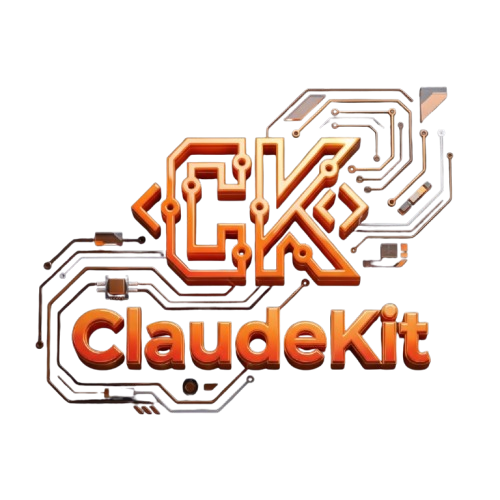

<div align="center">



# claudekit

**Everything the Anthropic SDK is missing — in one coherent Python framework.**

*Track costs. Enforce policies. Build agents. Ship faster.*

[](LICENSE)
[](pyproject.toml)
[](pyproject.toml)
[](pyproject.toml)
[](claudekit-docs/docs/modules/agents.md)
[](claudekit-docs/docs/modules/tools.md)

[Installation](#installation) · [Quick Start](#quick-start) · [What's Inside](#whats-inside) · [Platforms](#platforms) · [Documentation](#documentation)

</div>

---

## Installation

```bash
pip install claudekit
pip install claudekit[agent]   # Agent SDK support
pip install claudekit[mcp]     # MCP server builder
pip install claudekit[otel]    # OpenTelemetry tracing
pip install claudekit[all]     # Everything
```

---

## Quick Start

```python
from claudekit import TrackedClient

client = TrackedClient()
response = client.messages.create(
    model="claude-haiku-4-5",
    max_tokens=256,
    messages=[{"role": "user", "content": "Hello"}],
)
print(client.usage.summary())
# tokens_in=10  tokens_out=24  cost=$0.000042  calls=1
```

---

## What's Inside

| Module | What it does |
|---|---|
| `claudekit.client` | Tracked sync/async clients for Anthropic, Bedrock, Vertex, Foundry |
| `claudekit.security` | Typed policy pipeline — injection, jailbreak, PII, rate limits, budget caps |
| `claudekit.memory` | Persistent memory store with SQLite + FTS5, injected into context automatically |
| `claudekit.sessions` | Named sessions with config, lifecycle hooks, and aggregated usage |
| `claudekit.agents` | Declarative agents with budget guards and full message trace inspection |
| `claudekit.orchestration` | Multi-agent routing — rule-based, LLM-based, or manual |
| `claudekit.tools` | `@tool` decorator, tool registry, MCP server builder |
| `claudekit.skills` | Portable skill bundles — summarizer, classifier, extractor, reviewer, researcher |
| `claudekit.batches` | Fluent batch API with polling, cancellation, and cost stats |
| `claudekit.prompts` | Versioned prompt storage with A/B comparison |
| `claudekit.testing` | `MockClient`, `MockAgentRunner`, `expect.*` assertions, record/replay |
| `claudekit.plugins` | Lifecycle hooks — logging, cost alerts, OpenTelemetry |
| `claudekit.thinking` | Extended thinking helpers and token budget guidance |
| `claudekit.precheck` | Pre-flight token counting with cost estimates |

---

## Platforms

claudekit works the same across every Anthropic-supported platform:

```python
from claudekit import create_client  # auto-detects from env vars

# or explicitly:
from claudekit import TrackedBedrockClient, TrackedVertexClient, TrackedFoundryClient
```

---

## Documentation

**[Full Documentation →](claudekit-docs/docs/index.md)**

---

## License

[MIT](LICENSE)
